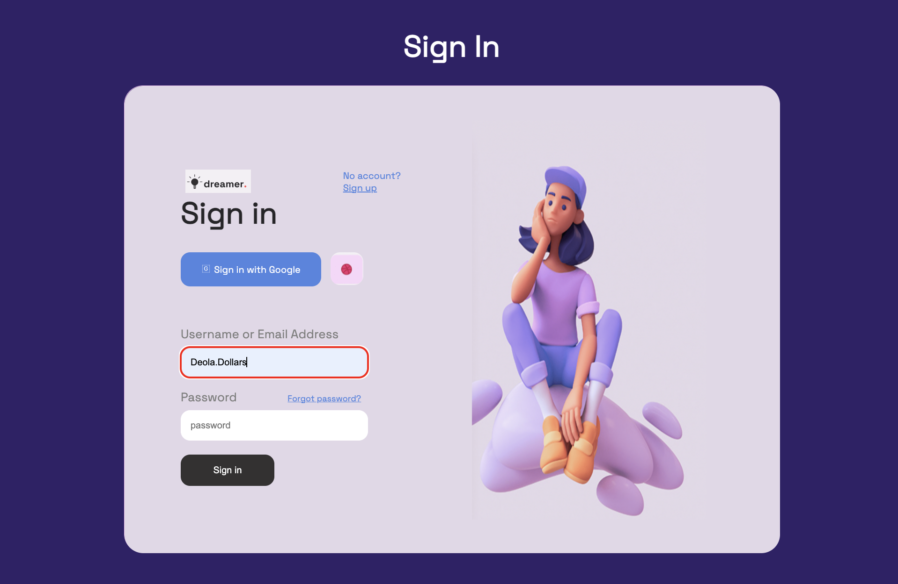
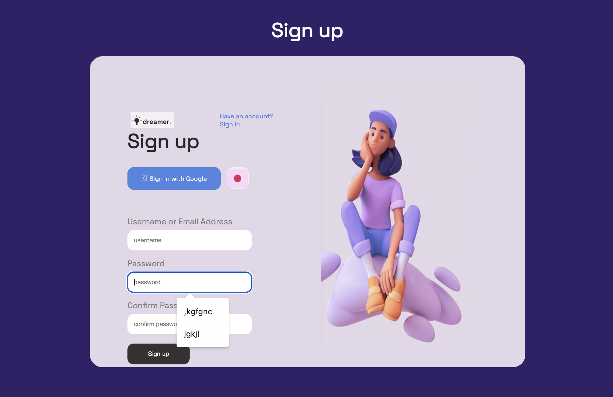

# Behance - Signin/Signup User Interface

This is a solution to the [Signin/Signup User Interface on Behance](https://www.behance.net/gallery/138768823/Sign-inSign-up-forms?tracking_source=search_projects%7Cweb%20UI%20form) by Kateryna Hlova

## Table of contents

- [Overview](#overview)
  - [Task](#task)
  - [Screenshot](#screenshot)
  - [Links](#links)
- [My process](#my-process)
  - [Built with](#built-with)
  - [Useful resources](#useful-resources)
- [Author](#author)

## Overview

### Task

Create Sign in and Sign up forms with different type of button and field states.

Users should be able to:

- View the optimal change in input field from Error state(red), Static state(white) and Success state(green).

### Screenshot

### Links

- Solution URL: [Solution](https://github.com/TheDeola/signin-signup)
- Live Site URL: [Live Site](https://signin-signup-form.netlify.app/)

## My process

### Built with

- Semantic HTML5 markup
- CSS custom properties
- Flexbox
- CSS Grid

### Useful resources

- [MDN](https://www.example.com) 
- [W3schools](https://www.example.com)

## Author

- Website - [TheDeola](https://www.your-site.com)
- Frontend Mentor - [@TheDeola](https://www.frontendmentor.io/profile/TheDeola)
- Twitter - [@deolacodes](https://www.twitter.com/deolacodes)

